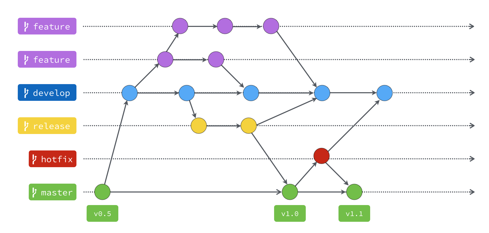

# Yet Another Delivery

# Техническое задание

## Описание предметной области

Cервис осуществляет прием заказов на доставку и распределяет их по ресторанам и курьерам.

Основные сущности:
* Ресторан - стороннее лицо, предоставляющее приложению доступное меню, принимающее от сервиса заявки на приготовление заказов.
* Меню - список доступных позиций, предоставляемых рестораном.
* Позиция - блюдо или иная продукция с определенной стоимостью, производимая рестораном и доступная к доставке через приложение.
* Заказ - набор позиций из одного ресторана, сформированный пользователем для единовременной доставки.
* Пользователь - человек, осуществляющий заказы через мобильное приложение.
* Курьер - человек, назначаемый приложением для забора заказа из ресторана и доставки его пользователю.
* Администратор - доверенное лицо, обладающее правами внесения новых курьеров и ресторанов в систему.

## Функциональные требования

### Сценарии покупателя

**Регистрация**

* Пользователь заполняет форму регистрации: телефон, имя, адрес (город, улица, дом, корпус/строение, подъезд, квартира/офис, этаж), пароль, подтверждение пароля
* Пользователь нажимает кнопку "Зарегистрироваться"
* Пользователь получает подтверждение об успешной регистрации и попадает на страницу авторизации

**Авторизация**

* Пользователь заполняет форму авторизации (телефон, пароль)
* Пользователь нажимает кнопку "Войти"
* Пользователь попадает на страницу списка ресторанов

**Редактирование профиля**

* Пользователь переходит на вкладку "Профиль"
* Пользователь заполняет форму редактирования профиля (имя, почта, адрес)
* Пользователь нажимает кнопку "Сохранить"
* Пользователь получает подтверждение об успешном изменении профиля

**Добавление блюда в корзину**

* Пользователь выбирает ресторан из списка ресторанов, отсортированных по близости к локации пользователя, указанной в профиле
* Пользователь выбирает блюдо из меню
* Пользователь вводит количество экземпляров выбранного блюда
* Пользователь нажимает кнопку "Добавить в корзину"
* Пользователь получает подтверждение о добавлении блюда в корзину (кнопка "Добавить в корзину" заменяется на кнопку "В корзине")

**Удаление блюда из корзины**

* Пользователь переходит на вкладку "Корзина" 
* Пользователь нажимает на кнопку "Удалить из корзины" рядом с определенным блюдом из списка блюд в корзине
* Пользователь получает подтверждение об удалении блюда из корзины (блюдо удаляется, стоимость заказа пересчитывается)

**Изменение количества экземпляров блюда в корзине**

* Пользователь переходит на вкладку "Корзина" 
* Пользователь нажимает на кнопку уменьшения (минус) или увеличения (плюс) рядом с определенным блюдом из списка блюд в корзине

**Оформление заказа**

* Пользователь переходит на вкладку "Корзина"
* Пользователь нажимает на кнопку “Оформить заказ”
* Пользователь переходит на страницу оформления заказа с полями для ввода
* Пользователь указывает адрес доставки (по умолчанию выставлен адрес, указанный при регистрации)
* Пользователь вводит реквизиты банковской карты (номер, имя, срок действия)
* Пользователь получает подтверждение об успешном оформлении заказа (пользователь перенаправляется на вкладку "История заказов", текущий заказ отображается первым в списке истории заказов и имеет статус "Готовится")

**Просмотр истории заказов**

* Пользователь переходит на вкладку "История заказов"
* Пользователь просматривает историю заказов

### Сценарии курьера

Администрация сервиса регистрирует курьеров через внутренний интерфейс

**Авторизация**

* Курьер заполняет форму авторизации (телефон, пароль)
* Курьер нажимает кнопку "Войти"
* Курьер попадает на вкладку "Работа"

**Начало работы**

* Курьер переходит на вкладку "Работа"
* Курьер устанавливает статус работы в "Работает"
* Курьер получает подтверждение об успешном изменении статуса

**Получение заказа**

* Курьер получает уведомление о получении заказа на доставку
* Курьер переходит по уведомлению на вкладку "Заказы", видит номер заказа, статус заказа - "Готовится", адрес ресторана и адрес заказчика

**Изменение статуса заказа**

* Курьер переходит на вкладку "Заказы"
* Курьер выбирает заказ из списка
* Курьер меняет статус заказа ("В пути", "Доставлено"); после выставления статуса “Доставлено” принимает решение о дальнейшем статусе работы
* Курьер получает подтверждение об успешном изменении статуса

Ресторану для взаимодействия с сервисом предоставляется API: авторизация, добавление блюд в меню, просмотр списка заказов, изменение статуса заказа и статуса работы. Система регистрирует рестораны через внутренний интерфейс.

# Технологии

## Репозитории

:computer: [Backend](https://github.com/MAVIKE/yad-backend)

:iphone: [Android](https://github.com/MAVIKE/yad-android)

:phone: [iOS](https://github.com/MAVIKE/yad-ios)

## Стек

### Backend

- [Golang](https://golang.org/)
- [Echo framework](https://github.com/labstack/echo)
- [PostgreSQL](https://www.postgresql.org/)
- [Docker](https://www.docker.com/)

### Android
 - [Java](https://www.java.com/ru/)
 - [JUnit](https://junit.org/junit4/javadoc/4.12/overview-summary.html)
 - [Gradle](https://gradle.org/)
 - [SQLite](https://www.sqlite.org/index.html)

### iOS
 - [Swift 5.0](https://www.apple.com/ru/swift/)
 - [Auto Layout](https://developer.apple.com/library/archive/documentation/UserExperience/Conceptual/AutolayoutPG/index.html)
 - [Core Data](https://developer.apple.com/documentation/coredata)
 - [Clean Swift](https://clean-swift.com)
 - [GCD](https://developer.apple.com/documentation/dispatch)
 - [Alamofire](https://github.com/Alamofire/Alamofire)

## Ограничения по клиентскому оборудованию и ОС

### Backend

 - [Linux Ubuntu 20.04 LTS](https://ubuntu.com/)
 - 4+ ГБ RAM

### Android

 - [Android 8.0 Oreo](https://en.wikipedia.org/wiki/Android_Oreo) (API 26) и выше
 - 4+ ГБ RAM
 - Разрешения
   - Интернет
   - Геоданные

### iOS
 - [iOS 13.0](https://www.apple.com/ru/newsroom/2019/06/apple-previews-ios-13/) и выше
 - iPhone 6S и более новые модели
 - Разрешения
   - Интернет
   - Геоданные

## Регламенты кодирования

[Backend](backend/rules.md)

[Android](https://github.com/ribot/android-guidelines/blob/master/project_and_code_guidelines.md)

[iOS](https://github.com/raywenderlich/swift-style-guide/blob/master/README.markdown)

## Правила ветвления

[Шпаргалка по git-flow](https://danielkummer.github.io/git-flow-cheatsheet/index.ru_RU.html)

## Правила версионирования

[Semantic Versioning 2.0](https://semver.org/)

# Участники команды

## Backend

<table>
<tr>
<td>

</td>
<td>

</td>
<td>

</td>
<td>

</td>
</tr>

<tr>
<td>

**Васюков Алексей**
a.vasyukov1@yandex.ru

</td>
<td>

**Волков Егор**
volkovegor2000@yandex.ru

</td>
<td>

**Колесников Даниил**
daniil.kolesnikoff@gmail.com

</td>
<td>

**Московский Дмитрий**
dimez77@mail.ru

</td>
</tr>
</table>

## Android application

<table>
<tr>
<td>

</td>
<td>

</td>
<td>

</td>
<td>

</td>
</tr>

<tr>
<td>

**Рязанов Максим**
ryazanovms@yandex.ru

</td>
<td>

**Степаненко Владимир**
vovac12@gmail.com

</td>
<td>

**Полякова Ксения**
KsenyaPolyakovaaa@gmail.com

</td>
<td>

**Левушкин Илья**
lik17u699@student.bmstu.ru

</td>
</tr>
</table>

## iOS application

<table>
<tr>
<td>

</td>
<td>

</td>
<td>

<tr>
<td>

**Иманов Шамиль**

studinfobmstu@yandex.ru

</td>
<td>

**Тимонин Антон**

antonandegor@mail.ru

</td>
<td>

**Тимонин Егор**

egor3359@bk.ru

</table>

